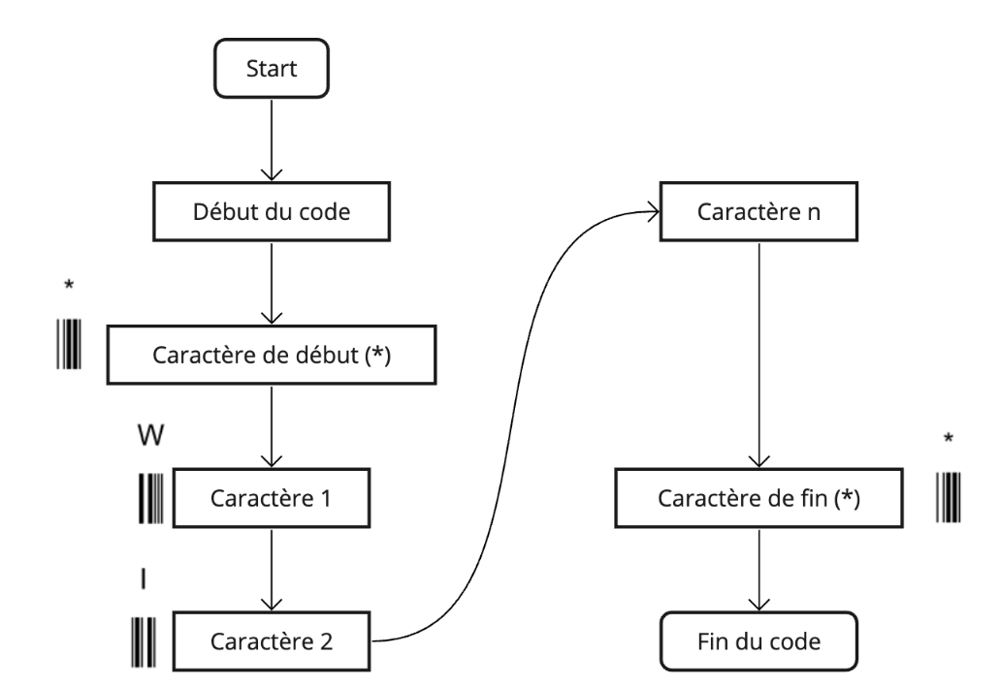
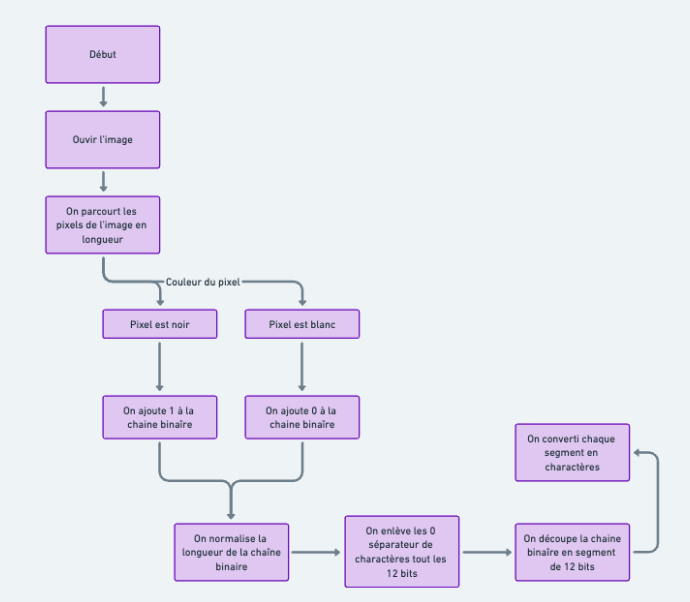
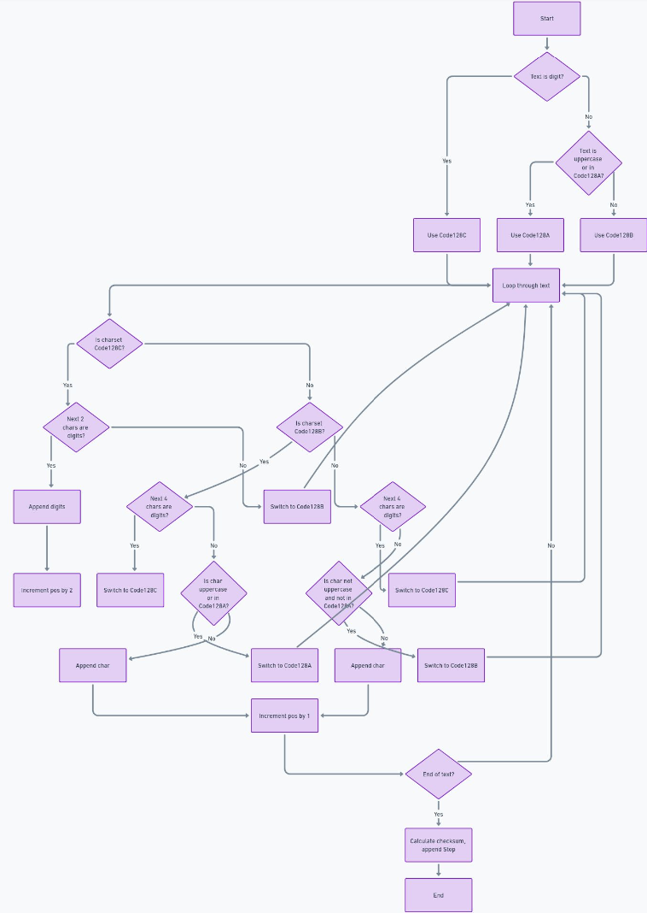

# Documentation du projet de génération et de lecture de codes-barres

Ce projet contient des scripts Python pour générer et lire des codes-barres Code39 et un script pour générer des codes-barres Code128.


## Remarque 

Ce projet devait à l'origine être un projet plus ambitieux : un système d'inventaire à base de codes-barres utilisant le téléphone portable comme scanner. Cependant, il a été réduit à un simple générateur et lecteur de codes-barres pour des raisons de temps et de complexité. Malgré l'existence de librairies pour la lecture de codes-barres, j'ai préféré ne pas les utiliser pour des raisons de compréhension et d'apprentissage. Mais également, pour des raisons de maîtrise de la lecture, les librairies de codes-barres ne permettent pas d'identifier le type de code-barre, ce qui était un point important pour mon projet initial de système d'inventaire à base de codes-barres. De plus, la plupart des librairies de lecture de codes-barres sont payantes.

## Dépendances

Ce projet utilise la bibliothèque PIL (Pillow) pour la manipulation d'images. Vous pouvez l'installer avec pip :

```sh
pip install pillow
```

# Préambule

Un code-barres est une représentation graphique d'une série de données. Il est généralement utilisé pour identifier des produits, des colis, des documents, etc.

Il existe plusieurs types de codes-barres, mais les plus courants sont les codes-barres linéaires, qui sont constitués de barres et d'espaces de différentes largeurs.

Les codes-barres linéaires les plus courants sont le Code39 et le Code128.

## Code39

### Structure

***Les codes-barres Code39 acceptent seulement les caractères suivants :***

- Les chiffres de 0 à 9
- Les lettres de A à Z
- L'espace
- Les caractères spéciaux suivants : - . $ / + %

***Le code-barres Code39 est constitué des éléments suivants :***

- Un caractère de début
- Les données à encoder
- Un caractère de fin

### Exemple

Le script [`code39.py`] contient la classe [`Code39BarcodeGenerator`] qui permet de générer un code-barres Code39 à partir d'une chaîne de caractères.

Voici comment utiliser cette classe :

```python
from code39 import Code39BarcodeGenerator

# Créer une instance de la classe avec les données à encoder
barcode = Code39BarcodeGenerator("CODE39")

# Générer le code-barres
barcode.generate(width=3, height=50)

# Afficher le code-barres
barcode.show()

# Enregistrer le code-barres dans un fichier
barcode.save("code39.png")
```

Algorithme pour générer le code-barres Code39



Le script [`code39_reader.py`] contient la classe [`Code39BarcodeDecoder`] qui permet de lire un code-barres Code39 à partir d'une image.

Voici comment utiliser cette classe :

```python
from code39_reader import Code39BarcodeReader

# Créer une instance de la classe avec le chemin vers l'image du code-barres
decoder = Code39BarcodeReader("code39.png")

# Décoder le code-barres
decoded_data = decoder.decode()

# Afficher les données décodées
print(decoded_data)
```

Algorithme pour lire le code-barres Code39



## Code128

### Structure

***Les codes-barres Code128 acceptent tous les caractères ASCII.***

***Le code-barres Code128 est constitué des éléments suivants :***

- Zone tranquille
- Un caractère de début
- Les données à encoder
- Un caractère de fin
- Zone tranquille

### Exemple

Le script [`code128.py`] contient la classe [`Code128BarcodeGenerator`] qui permet de générer un code-barres Code128 à partir d'une chaîne de caractères.

Voici comment utiliser cette classe :

```python
from code128 import Code128BarcodeGenerator

# Créer une instance de la classe avec les données à encoder
barcode = Code128BarcodeGenerator("Wikip3di4")

# Générer le code-barres
barcode.generate(height=100, thickness=3, quiet_zone=True)

# Afficher le code-barres
barcode.show()

# Enregistrer le code-barres dans un fichier
barcode.save("code128.png")
```

Algorithme pour générer le code-barres Code128



Ce projet ne contient pas de script pour lire les codes-barres Code128 par manque de temps.
